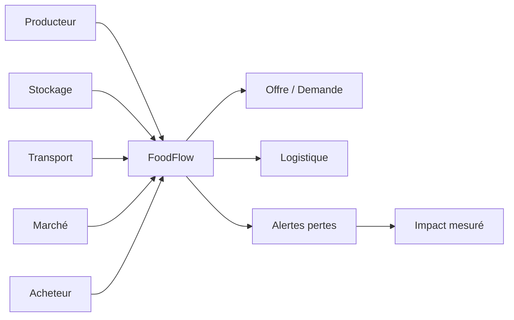

# HashCode FoodFlow

> Infrastructure numérique pour réduire les pertes alimentaires et améliorer la coordination producteur–stockage–transport–marché.

**Domaine:** Web & Software Engineering · **Programme:** HashCode Global Impact · **Statut:** Research / MVP discovery

## Problème
Les pertes après récolte sont liées notamment au stockage, au transport et au manque de synchronisation entre offre et demande.

## Vision
Relier producteurs, coopératives, transporteurs, entrepôts, marchés et acheteurs autour d'une couche de données et de coordination.

## Cartographie

## MVP
Inventaire, capacité de stockage, offre/demande, planification logistique, alertes de vieillissement et tableau de bord des pertes.

## Méthode
Commencer par une filière et une zone pilote, établir une mesure de référence, tester, mesurer puis itérer.

## Impact
Tonnes sauvées, valeur économique préservée, délais logistiques, utilisation du stockage et revenu producteur.

## Contribuer
Voir : https://github.com/HashCode-Reboot/hashcode-contributors

**Doctrine HashCode:** *Build for Africa. Scale for Humanity.*