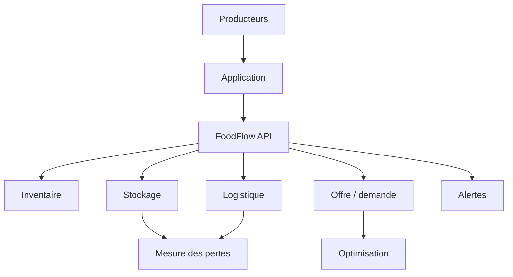

# Architecture — FoodFlow

## Principes

Mobile-first, synchronisation tolérante aux coupures, données horodatées, traçabilité de provenance et séparation entre observations et prédictions.

Les recommandations de prix, demande ou logistique doivent être présentées comme des estimations et évaluées contre les résultats terrain.